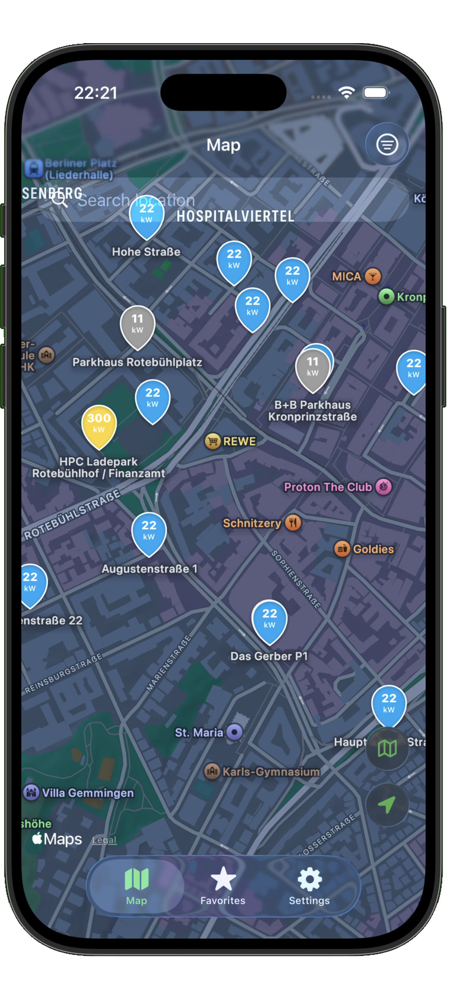
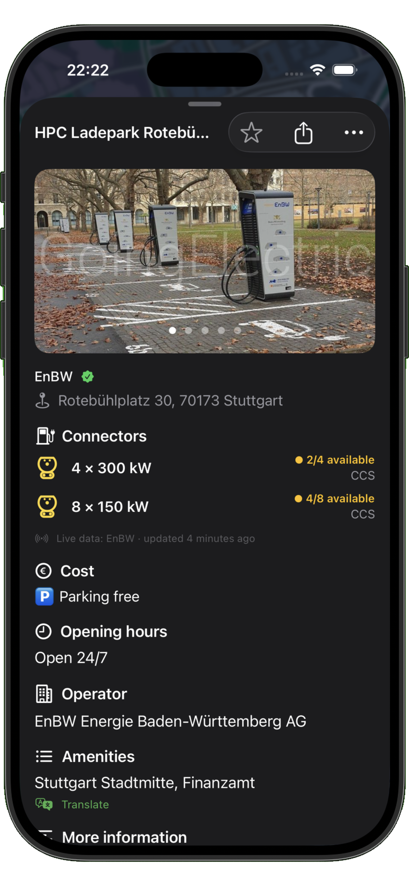
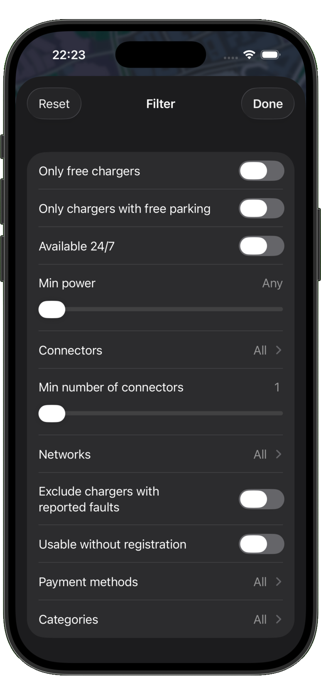

# EVMap iOS

A native iOS/SwiftUI port of [EVMap](https://ev-map.app), an open-source Android app for finding EV charging stations (MIT License, Copyright Johan von Forstner). Ad-free, non-commercial, open source.

<p align="center">
  
  
  
</p>

## Features

- **Multiple data sources**: GoingElectric (DACH), Open Charge Map (worldwide), Nobil (Norway/Sweden). Use one or combine several simultaneously
- **Map**: Color-coded pins by power level, client- and server-side clustering, map styles (standard/satellite/hybrid)
- **Station detail**: Connectors with type icons and power, opening hours, costs, photos (swipeable, zoomable), charge cards, real-time availability
- **Real-time availability**: EnBW API for GoingElectric stations in DACH/EU (live connector status)
- **Filters**: Connector type, power, network, charge cards, barrier-free, and more, with per-source support indicators when multiple sources are active simultaneously
- **Filter profiles**: Save and load custom filter presets
- **Favorites**: Star stations, sort by distance, tap to jump to map
- **Location search**: Apple Maps autocomplete
- **Translation**: Translate station notes and amenities with Apple's native Translation framework (no API key required)
- **Chargeprice integration**: Deep-link to price comparison for supported stations
- **Onboarding**: Pin legend and data source selection

## Requirements

- iOS 26.2+
- Xcode 26.3+
- API keys for the data sources you want to use (see setup below)

## Getting Started

### 1. Clone the repository

```bash
git clone https://github.com/MaxXLive/ev-charge-ios.git
cd ev-charge-ios/evmap
```

### 2. Configure API keys

Copy the example secrets file and fill in your keys:

```bash
cp evmap/Secrets.example.plist evmap/Secrets.plist
```

Edit `evmap/Secrets.plist`:

| Key | Where to get it |
|-----|-----------------|
| `GOINGELECTRIC_API_KEY` | Request at [goingelectric.de](https://www.goingelectric.de) |
| `OPENCHARGEMAP_API_KEY` | Register at [openchargemap.org](https://openchargemap.org/site/develop/api) |
| `NOBIL_API_KEY` | Request at [nobil.no](https://info.nobil.no/api) |

`Secrets.plist` is gitignored and will never be committed. The app handles missing keys gracefully: sources without a key show an error in the UI rather than crashing.

### 3. Open in Xcode and run

```bash
open evmap.xcodeproj
```

Select a simulator or device and press Run (`⌘R`).

## Project Structure

```
evmap/evmap/
├── Core/               # AppState, ChargepointAPI protocol, DataSource registry, Secrets
├── Models/             # ChargeLocation, Chargepoint, Filters, SwiftData persistence models
├── API/
│   ├── GoingElectric/  # GE REST API (form-encoded POST, server clustering)
│   ├── OpenChargeMap/  # OCM REST API (GET, bbox/radius)
│   ├── Nobil/          # Nobil REST API (POST JSON, rectangle/radius search)
│   ├── Availability/   # EnBW real-time availability detector
│   └── Chargeprice/    # Deep-link helper
├── ViewModels/         # MapViewModel (multi-source loading, clustering, filters)
└── Views/              # All SwiftUI views
```

## Architecture

- **Swift/SwiftUI**: no UIKit, no third-party UI or map frameworks
- **`@Observable` + `@MainActor`** on all ViewModels; value types marked `nonisolated`
- **`SWIFT_DEFAULT_ACTOR_ISOLATION = nonisolated`** build setting that prevents value types from inheriting MainActor isolation, which would break cross-actor access from availability detector actors
- **`ChargepointAPI` protocol**: a source-agnostic data layer. `MapViewModel` queries all active sources in parallel via `withTaskGroup` and merges results client-side
- **Multi-source mode**: `DataSourceID.selectedSet` stored as comma-separated string in `UserDefaults`. Each source's filter keys are hardcoded in `DataSourceID.supportedFilterKeys`, which drives greyed-out filter indicators without requiring a network round-trip
- **SwiftData**: `FavoriteEntity`, `FilterProfileEntity` for local persistence
- **MapKit**: SwiftUI `Map`, `MKLocalSearchCompleter`, annotation clustering

## Differences from the Android Original

This is a fresh native rewrite, not a 1:1 reproduction. Where the iOS platform offers a better idiom, we followed it rather than mirroring the Android implementation:

- **Multiple data sources at once**: The Android app lets you pick a single active data source at a time. Here you can enable GoingElectric, Open Charge Map, and Nobil together and see merged results on one map. **Why:** the sources have complementary coverage (GE is strong in DACH, Nobil in Norway/Sweden, OCM worldwide), so combining them gives more complete results in border regions and on trips than forcing the user to switch sources manually and lose context. This drove additional work the original never needed: client-side clustering for non-GE sources (GE keeps its server clusters), a union of available filters across active sources, and per-source filter support indicators that grey out filters a given source can't honor.
- **Language follows system settings**: The Android app ships an in-app language picker. On iOS we rely on the standard per-app language setting in the system Settings. **Why:** iOS gives every app a system-managed per-app language screen for free, so an in-app picker would duplicate platform functionality and diverge from what users expect on the platform.
- **Translation of free-text fields (add-on)**: Station notes and amenities, which sources return as untranslated free text, can be translated on demand with Apple's native Translation framework. **Why:** this is an iOS-only convenience the original doesn't have; using the system framework means no extra API key, no per-request cost, and on-device translation.
- **Native iOS layout, not an Android port**: The UI is built from scratch in SwiftUI following Apple's Human Interface Guidelines: a `TabView` for Map / Favorites / Settings, native `Map` with SwiftUI annotations, `.sheet` detail presentation, and system components throughout. Screens and navigation match iOS expectations rather than copying Android's Material layout.
- **No third-party UI or map frameworks**: Pure SwiftUI + MapKit, no UIKit. The Android app uses Mapbox/Google Maps; here MapKit covers map rendering, clustering, and location search.
- **Apple-native persistence**: SwiftData for favorites and filter profiles instead of the Android Room/database stack.

What is intentionally kept the same: the data-source APIs and models, filter definitions, pin color logic by power level, and EnBW real-time availability matching, all ported to stay faithful to the original behavior.

## Adding a New Data Source

1. Implement `ChargepointAPI` in `API/<SourceName>/`
2. Add a case to `DataSourceID` in `Core/DataSource.swift`
3. Populate `supportedFilterKeys` for the new case (drives filter greying in multi-source mode)
4. Wire up `makeAPI()` and add the key to `Secrets.swift` / `Secrets.example.plist`

## Releasing to the App Store

App Store Connect automation lives in `evmap/fastlane/`. See `evmap/fastlane/SETUP.md` for the one-time setup (API key, UITest target).

```bash
cd evmap

# Upload metadata + screenshots (10 languages) only — no binary
fastlane metadata

# Build + upload to TestFlight (no build number bump)
NO_BUMP=1 fastlane beta

# Full release: build, metadata, screenshots, submit for review
fastlane release
```

Screenshots are captured automatically by `fastlane screenshots` (snapshot → frameit → 1290×2796 pad), then uploaded by `metadata`/`release`.

## Versioning

Version and build number follow the scheme `MAJOR.MINOR.PATCH (BUILD)`. Bugfixes bump the build number, minor features bump the patch version, and new feature areas bump the minor version. `MARKETING_VERSION` and `CURRENT_PROJECT_VERSION` live in the Xcode project (Debug and Release).

## License

This project is licensed under the **MIT License**. See [LICENSE](LICENSE) for details.

EVMap Android (original): Copyright © Johan von Forstner, MIT License  
Third-party credits: see [THIRD_PARTY.md](THIRD_PARTY.md)

## Credits

Based on [EVMap](https://github.com/ev-map/EVMap) by Johan von Forstner.  
Data provided by [GoingElectric.de](https://www.goingelectric.de), [Open Charge Map](https://openchargemap.org), and [Nobil](https://nobil.no).  
Real-time availability via [EnBW](https://www.enbw.com/elektromobilitaet/).
